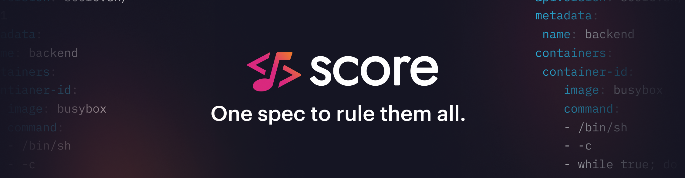
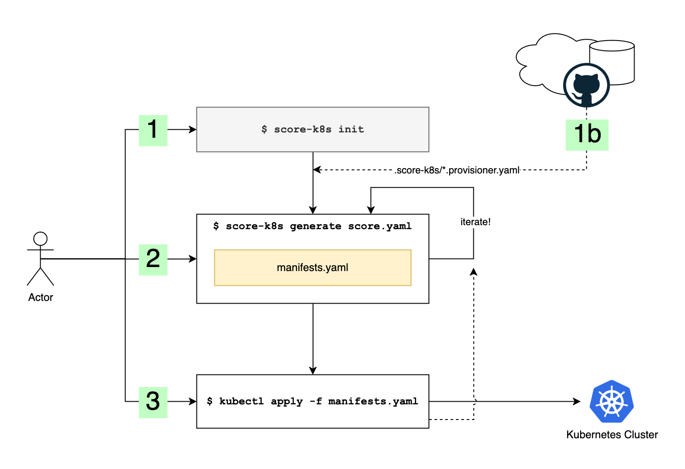

[](https://github.com/score-spec/score-k8s/actions/workflows/ci.yaml)
[](https://github.com/score-spec/score-k8s/actions/workflows/release.yaml)
[](https://github.com/score-spec/score-k8s/issues?q=is%3Aissue+is%3Aopen+label%3A%22good+first+issue%22)
[](https://opensource.org/licenses/Apache-2.0)
[](https://app.fossa.com/projects/git%2Bgithub.com%2Fscore-spec%2Fscore-k8s?ref=badge_shield&issueType=license)
[](CODE_OF_CONDUCT.md)
[](https://scorecard.dev/viewer/?uri=github.com/score-spec/score-k8s)
[](https://www.bestpractices.dev/projects/9913)



# score-k8s

`score-k8s` is a reference implementation of the [Score specification](https://github.com/score-spec/spec) for [Kubernetes](https://kubernetes.io/). It converts Score files into a YAML file containing Kubernetes manifests that can be packaged or installed through `kubectl apply`. `score-k8s` is used primarily for demonstration and reference purposes but _may_ be used for pre-production/production use if necessary.

This implementation supports most aspects of the Score specification and provides a powerful resource provisioning system for supplying and customising the dynamic configuration of attached services such as databases, queues, storage, and other network or storage APIs.



1. The user runs `score-k8s init` in their project to initialise the empty state and default provisioners

    1b. The user can import, copy, or download a custom set of extended resource provisioners that they or their platform team have developed specific to the target cluster.

2. The user runs `score-k8s generate` to add Score files to the project and generate a `manifests.yaml` file. Multiple score files can be added and the resulting manifests will include all workloads and all resources together.
3. Iterate by changing the score files, and re-running `generate`.
4. The manifests can then be validated and deployed through `kubectl apply -f manifests.yaml`.
5. To remove the resources from the cluster, the same `kubectl delete -f manifests.yaml` can be used.

## Feature support

`score-k8s` supports all features of the Score Workload specification.

## Resource support

`score-k8s` supports a full resource provisioning system which converts workload artefacts into outputs and/or a set of Kubernetes manifests. The resource system works similarly to `score-compose` with one or more YAML files describing how to provision a set of supported resources. Users and teams can supply their own provisioners files to extend this set.

Provisioners are loaded from any `*.provisioners.yaml` files in the local `.score-k8s` directory, and matched to the resources by the `type` and optional `class` and `id` fields. Matches are performed with a first-match policy, so default provisioners can be overridden by supplying a custom provisioner with the same `type`.

Generally, users will want to copy in the provisioners files that work with their cluster. For example, if the cluster has Postgres or MySQL operators installed, then custom provisioners can be written to provision a database using the operator-specific CRDs with any clustering and backup mechanisms configured.

For details of how the standard "template" provisioner works, see the `template://example-provisioners/example-provisioner` provisioner [here](internal/provisioners/default/zz-default.provisioners.yaml). For details of how the standard "cmd" provisioner works, see the `cmd://bash#example-provisioner` provisioner [here](internal/provisioners/default/zz-default.provisioners.yaml).

## Provisioner support

`score-k8s` comes with out-of-the-box support for:

| Type          | Class   | Params                 | Output                                                          |
| ------------- | ------- | ---------------------- |-----------------------------------------------------------------|
| volume        | default | (none)                 | `source`                                                        |
| redis         | default | (none)                 | `host`, `port`, `username`, `password`                          |
| postgres      | default | (none)                 | `host`, `port`, `name` (aka `database`), `username`, `password` |
| mysql         | default | (none)                 | `host`, `port`, `name` (aka `database`), `username`, `password` |
| dns           | default | (none)                 | `host`                                                          |
| route         | default | `host`, `path`, `port` |                                                                 |
| mongodb       | default | (none)                 | `host`, `port`, `username`, `password`, `name`, `connection`    |
| ampq          | default | (none)                 | `host`, `port`, `username`, `password`, `vhost`                 |
| mssql         | default | (none)                 | `server`, `port`, `database`, `password`                        |
| s3            | default | (none)                 | `endpoint`, `region`, `bucket`, `access_key_id`, `secret_key`   |

Users are encouraged to write their own custom provisioners to support new resource types or to modify the implementations above.

## Commands

### Init

```
$ score-k8s init --help
The init subcommand will prepare the current directory for working with score-k8s and write the initial
empty state and default provisioners file into the '.score-k8s' subdirectory.

The '.score-k8s' directory contains state that will be used to generate any Kubernetes resource manifests including
potentially sensitive data and raw secrets, so this should not be checked into generic source control.

Custom provisioners can be installed by uri using the --provisioners flag. The provisioners will be installed and take
precedence in the order they are defined over the default provisioners. If init has already been called with provisioners
the new provisioners will take precedence.

To adjust the generated manifests, or perform post processing actions, you can use the --patch-templates flag to provide
one or more template files by uri. Each template file is stored in the project and then evaluated as a 
Golang text/template and should output a yaml/json encoded array of patches. Each patch is an object with required 'op' 
(set or delete), 'patch' (a dot-separated json path), a 'value' if the 'op' == 'set', and an optional 'description' for 
showing in the logs. The template has access to '.Manifests' and '.Workloads'.

Usage:
  score-k8s init [flags]

Examples:

  # Initialise a new score-k8s project
  score-k8s init

  # Or disable the default score file generation if you already have a score file
  score-k8s init --no-sample

  # Optionally loading in provisoners from a remote url
  score-k8s init --provisioners https://raw.githubusercontent.com/user/repo/main/example.yaml

  # Optionally adding a couple of patching templates
  score-k8s init --patch-templates ./patching.tpl --patch-templates https://raw.githubusercontent.com/user/repo/main/example.tpl

URI Retrieval:
  The --provisioners and --patch-templates arguments support URI retrieval for pulling the contents from a URI on disk
  or over the network. These support:
    - HTTP        : http://host/file
    - HTTPS       : https://host/file
    - Git (SSH)   : git-ssh://git@host/repo.git/file
    - Git (HTTPS) : git-https://host/repo.git/file
    - OCI         : oci://[registry/][namespace/]repository[:tag|@digest][#file]
    - Local File  : /path/to/local/file
    - Stdin       : - (read from standard input)

Flags:
  -f, --file string                  The score file to initialize (default "score.yaml")
  -h, --help                         help for init
      --no-sample                    Disable generation of the sample score file
      --patch-templates stringArray   Patching template files to include. May be specified multiple times. Supports URI retrieval.
      --provisioners stringArray     Provisioner files to install. May be specified multiple times. Supports URI retrieval.

Global Flags:
      --quiet           Mute any logging output
  -v, --verbose count   Increase log verbosity and detail by specifying this flag one or more times
```

### Generate

```
$ score-k8s generate --help
The generate command will convert Score files in the current Score state into a combined set of Kubernetes
manifests. All resources and links between Workloads will be resolved and provisioned as required.

"score-k8s init" MUST be run first. An error will be thrown if the project directory is not present.

Usage:
  score-k8s generate [flags]

Examples:

  # Specify Score files
  score-k8s generate score.yaml *.score.yaml

  # Regenerate without adding new score files
  score-k8s generate

  # Provide a default container image for any containers with image=.
  score-k8s generate score.yaml --image=nginx:latest

  # Provide overrides when one score file is provided
  score-k8s generate score.yaml --override-file=./overrides.score.yaml --override-property=metadata.key=value

  # Patch resulting manifests
  score-k8s generate score.yaml --patch-manifests */*/metadata.annotations.key=value --patch-manifests Deployment/foo/spec.replicas=4

  # Set namespace for all resources
  score-k8s generate score.yaml --namespace=test-ns

  # Generate namespace manifest and set namespace for all resources
  score-k8s generate score.yaml --namespace=test-ns --generate-namespace

Flags:
  -h, --help                            help for generate
      --image string                    An optional container image to use for any container with image == '.'
  -o, --output string                   The output manifests file to write the manifests to (default "manifests.yaml")
      --override-property stringArray   An optional set of path=key overrides to set or remove
      --overrides-file string           An optional file of Score overrides to merge in
      --patch-manifests stringArray     An optional set of <kind|*>/<name|*>/path=key operations for the output manifests
      --namespace string               An optional namespace to set for all generated resources
      --generate-namespace              If true, generate a namespace manifest (requires --namespace to be set)
```

### Shell Completions

```
$ score-k8s completion --help
Generate the autocompletion script for score-k8s for the specified shell.
See each sub-command's help for details on how to use the generated script.

Usage:
  score-k8s completion [command]

Available Commands:
  bash        Generate the autocompletion script for bash
  fish        Generate the autocompletion script for fish
  powershell  Generate the autocompletion script for powershell
  zsh         Generate the autocompletion script for zsh

Flags:
  -h, --help   help for completion

Global Flags:
      --quiet           Mute any logging output
  -v, --verbose count   Increase log verbosity and detail by specifying this flag one or more times

Use "score-k8s completion [command] --help" for more information about a command.
```

## Installation

Either, install through Homebrew for macOS and supported Linux distributions:

```
$ brew install score-spec/tap/score-k8s
# to upgrade an existing installation, tr
$ brew upgrade score-k8s
```

Or, download the binaries for your platform from the [latest Github releases](https://github.com/score-spec/score-k8s/releases):

```
$ wget https://github.com/score-spec/score-k8s/releases/download/<x.y.z>/score-k8s_<x.y.z>_<os_system>.tar.gz
```

Or, install the Go module directly (Go > 1.23):

```
$ go install -v github.com/score-spec/score-k8s/cmd/score-k8s@latest
```

Alternative installation guides and implementations can be found in the [Score docs](https://docs.score.dev/docs/score-implementation/score-k8s/#installation).

## FAQ

### Why are there so few default resource provisioners?

Kubernetes is a complex environment to provide defaults for since there are so many different ways to configure it and so many different ways to deploy the same resource. For example, should a Database be provisioned using a Helm chart, a set of manifests, an operator CRD, a cloud-specific operator CRD? These are not questions that have easy default answers and so we encourage users to build and share a set of custom provisioners depending on the cluster they aim to deploy to.

### Why does the default provisioners file have a `zz-` prefix?

The provisioner files are loaded in lexicographic order, the `zz` prefix helps to ensure that the defaults are loaded last and that any custom provisioners have precedence.

### How can I write my own provisioner?

Provisioners can be written as templates for score-k8s to evaluate or a command/script that will be called. Write a file following the conventions used in the example provisioners from [zz-default.provisioners.yaml](./internal/provisioners/default/zz-default.provisioners.yaml). Then add this to your project by running `score-k8s init --provisioners ./your-custom.provisioners.yaml`.

Other resources can be found at:
- https://github.com/score-spec/community-provisioners
- https://score.dev/blog/writing-a-custom-score-compose-provisioner-for-apache-kafka/
- `score-k8s init --help`

### Does score-k8s generate a Deployment or StatefulSet?

`score-k8s` generates a Deployment by default or when the `k8s.score.dev/kind` workload metadata annotation is set to `Deployment`. If the annotation is set to `StatefulSet` it will generate a set and allow the use of claim templates as outputs from volume resources.

### How do I configure the number of replicas or security context for the workload deployment?

`score-k8s` will always generate a deployment or set with 1 replica. The workload should be scaled to multiple replicas through either:

1. Scale up in-cluster after deployment (`kubectl scale --replicas=3 deployment/my-workload`).
2. Or, use a [Kustomize](https://kustomize.io/) patch to override the number of replicas with `kubectl apply -k`.
3. Or, use a `--patch-templates` template to set the `spec.replicas` in the relevant workloads (see further below).

### Managing Namespaces

The `score-k8s generate` command provides two flags for namespace management:

1. `--namespace`: Sets the namespace for all generated resources. When this flag is used, all resources in the generated manifests will have their `metadata.namespace` field set to the specified value.

2. `--generate-namespace`: When used with `--namespace`, this flag will generate a Namespace manifest at the beginning of the output file. The namespace manifest will include appropriate labels (`app.kubernetes.io/managed-by: score-k8s`).

Example usage:
```bash
# Set namespace for all resources
score-k8s generate score.yaml --namespace=test-ns

# Generate namespace manifest and set namespace for all resources
score-k8s generate score.yaml --namespace=test-ns --generate-namespace
```

### Which namespace will manifests be deployed into?

Right now, no namespace is specified in the generated manifests so they will obey any `--namespace` passed to the `kubctl apply` command. All secret references are assumed to be in the same namespace as the workloads.

### How do I modify the generated manifests or add and remove from them?

Use the `--patch-templates` options. Patch templates are small Go Text Template files which can output a set of JSON "patch" operations on the list of manifests. This is intended to deprecate the `--patch-manifests` option.

Template inputs:

```
.Manifests: the array of generated manifests from the Score conversion process
.Workloads: the map of workload name to Score specification
```

The patch should follow this schema:

```yaml
type: object
required: ["op", "path"]
properties:
  op:
    description: The patch operation to perform at the path
    type: string
    enum: ["set", "delete"]
  path:
    description: "A .-separated JSON path. Numeric indexes can be used to reference array indices. -1 allows appending to an array. : can be used to escape an otherwise numeric index."
    type: string
  value:
    description: The value to set at the path when a 'set' operation is used.
  description:
    description: An optional description which is included in the log output when the patch is applied
    type: string
```

As an example, to set the replicas for the Deployment of the workload named 'example':

```
{{ range $i, $m := .Manifests }}
{{ if and (eq $m.kind "Deployment") (eq (dig "metadata" "annotations" "k8s.score.dev/workload-name" "" $m) "example") }}
- op: set
  path: {{ $i }}.spec.replicas
  value: 3
  description: Increase the replicas for the example deployment
{{ end }}
{{ end }}
```

A similar approach can be done to inject security context restrictions, service accounts, labels, annotations, or to even convert a manifest from Deployment
into a different Kubernetes `kind` entirely through a series of patch modifications.

### How do I test `score-k8s` with `kind` (Kubernetes in docker)?

The main requirement is that the route resource provisioner assumes that the Gateway API implementation is available with a named Gateway "default".

Setup the cluster:

```console
$ kind create cluster
$ kubectl --context kind-kind apply -f https://github.com/kubernetes-sigs/gateway-api/releases/download/v1.1.0/standard-install.yaml
$ helm --kube-context kind-kind install ngf oci://ghcr.io/nginxinc/charts/nginx-gateway-fabric --create-namespace -n nginx-gateway --set service.type=ClusterIP
$ kubectl --context kind-kind apply -f - <<EOF
apiVersion: gateway.networking.k8s.io/v1
kind: Gateway
metadata:
  name: default
spec:
  gatewayClassName: nginx
  listeners:
  - name: http
    port: 80
    protocol: HTTP
EOF
```

Then if you want to call the gateway routes, open a port forward:

```
$ kubectl --context kind-kind -n nginx-gateway port-forward service/ngf-nginx-gateway-fabric 8080:80
```

And DNS resources can be accessed on http://<prefix>.localhost:8080, or using a command like the following to get the generated dns name:

```
$ score-k8s resources get-outputs 'dns.default#demo-app.dns' --format '{{.host}}'
```

### Once I have provisioned a resource, how do I delete it or clean it up?

Resource cleanup has not been implemented yet. The only mechanism today is limited to deleting the Kubernetes manifests output by a template provisioner. As a workaround, the YAML structure in `.score-k8s/state.yaml` can be interpreted to determine what side effects need to be cleaned up.

## Get in touch

Learn how to connect and engage with our community [here](https://github.com/score-spec/spec?tab=readme-ov-file#-get-in-touch).

### Contribution Guidelines and Governance

Our general contributor guidelines can be found in [CONTRIBUTING.md](CONTRIBUTING.md). Please note that some repositories may have additional guidelines. For more information on our governance model, please refer to [GOVERNANCE.md](https://github.com/score-spec/spec/blob/main/GOVERNANCE.md).

### Documentation

You can find our documentation at [docs.score.dev](https://docs.score.dev/docs).

### Roadmap

See [Roadmap](https://github.com/score-spec/spec/blob/main/roadmap.md). You can [submit an idea](https://github.com/score-spec/spec/blob/main/roadmap.md#get-involved) anytime.
