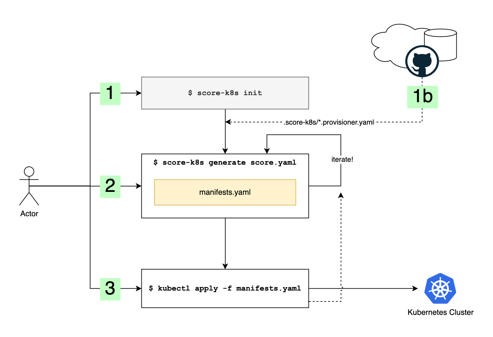

# score-k8s

`score-k8s` is an implementation of the Score Workload specification for Kubernetes and converts input Score files into a YAML file containing Kubernetes manifests that can be packaged or installed through `kubectl apply`. `score-k8s` is a reference implementation for [Score](https://docs.score.dev/) and is used mostly for demonstration and reference purposes but _may_ be used for pre-production/production use if necessary.

`score-k8s` supports most aspects of the Score Workload specification and supports a powerful resource provisioning system for supplying and customising the dynamic configuration of attached services such as databases, queues, storage, and other network or storage APIs.



## Score overview

Score aims to improve developer productivity and experience by reducing the risk of configuration inconsistencies between local and remote environments. It provides developer-centric workload specification (`score.yaml`) which captures a workloads runtime requirements in a platform-agnostic manner. Learn more [here](https://github.com/score-spec/spec#-what-is-score).

The `score.yaml` specification file can be executed against a _Score Implementation CLI_, a conversion tool for application developers to generate environment specific configuration. In combination with environment specific parameters, the CLI tool can run your workload in the target environment by generating a platform-specific configuration file.

An example Score file may look like:

```yaml
apiVersion: score.dev/v1b1
metadata:
  name: demo-app
# The workload contains a single container with a demo image
containers:
  main:
    image: ghcr.io/astromechza/demo-app:latest
    variables:
      # We're injecting a redis resource here that gets provisioned from the resources section
      OVERRIDE_REDIS: "redis://${resources.cache.username}:${resources.cache.password}@${resources.cache.host}:${resources.cache.port}"
# Declare that this service exposes port 8080, we're using that in the route resource
service:
  ports:
    web:
      port: 8080
resources:
  # The dns resource provisions a 'host' output as a valid hostname.
  dns:
    type: dns
  # The route resource routes requests matching the prefix path and hostname to our service port
  route:
    type: route
    params:
      host: ${resources.dns.host}
      path: /
      port: 8080
  # And here is the definition of our cache resource
  cache:
    type: redis
```

## Feature support

`score-k8s` supports all features of the Score Workload specification.

## Resource support

`score-k8s` supports a full resource provisioning system which converts workload artefacts into outputs and/or a set of Kubernetes manifests. The resource system works similarly to `score-compose` with one or more YAML files describing how to provision a set of supported resources. Users and teams can supply their own provisioners files to extend this set.

Provisioners are loaded from any `*.provisioners.yaml` files in the local `.score-k8s` directory, and matched to the resources by the `type` and optional `class` and `id` fields. Matches are performed with a first-match policy, so default provisioners can be overridden by supplying a custom provisioner with the same `type`.

A common workflow may be:

1. `score-k8s init` to initialize the state directory if it doesn't exist already
2. `curl https://my-team.my-org.example.org/score-k8s-custom-provisioners.yaml > .score-k8s/custom.provisioners.yaml` to import or copy your team's custom provisioners file
3. Optionally, `rm .score-k8s/zz-default.provisioners.yaml` to remove the default provisioners (a good idea in production).
4. `score-k8s generate score.yaml`
5. `kubectl apply -f manifests.yaml`

## FAQ

### Why are there so few default resource provisioners?

Kubernetes is a complex environment to provide defaults for since there are so many different ways to configure it and so many different ways to deploy the same resource. For example, should a Database be provisioned using a Helm chart, a set of manifests, an operator CRD, a cloud-specific operator CRD? These are not questions that have easy default answers and so we encourage users to build and share a set of custom provisioners depending on the cluster they aim to deploy to.

### Why does the default provisioners file have a `zz-` prefix?

The provisioner files are loaded in lexicographic order, the `zz` prefix helps to ensure that the defaults are loaded last and that any custom provisioners have precedence.

### Does score-k8s generate a Deployment or StatefulSet?

`score-k8s` generates a Deployment by default or when the `k8s.score.dev/kind` workload metadata annotation is set to `Deployment`. If the annotation is set to `StatefulSet` it will generate a set and allow the use of claim templates as outputs from volume resources.

### How do I configure the number of replicas for the workload?

`score-k8s` will always generate a deployment or set with 1 replica. The workload should be scaled to multiple replicas through either:

1. Scale up in-cluster after deployment (`kubectl scale --replicas=3 deployment/my-workload`).
2. Or, use a [Kustomize](https://kustomize.io/) patch to override the number of replicas with `kubectl apply -k`.

### Which namespace will manifests be deployed into?

Right now, no namespace is specified in the generated manifests so they will obey any `--namespace` passed to the `kubctl apply` command. All secret references are assumed to be in the same namespace as the workloads.

### How do I test `score-k8s` with with `kind` (Kubernetes in docker)?

The main requirement is that the route resource provisioner assumes that the Gateway API implementation is available with a named Gateway "default".

Setup the cluster:

```console
$ kind create cluster
$ kubectl --context kind-kind apply -f https://github.com/kubernetes-sigs/gateway-api/releases/download/v1.0.0/standard-install.yaml
$ helm --kube-context kind-kind install ngf oci://ghcr.io/nginxinc/charts/nginx-gateway-fabric --create-namespace -n nginx-gateway --set service.type=ClusterIP
$ kubectl --context kind-kind apply -f - <<EOF
apiVersion: gateway.networking.k8s.io/v1
kind: Gateway
metadata:
  name: default
spec:
  gatewayClassName: nginx
  listeners:
  - name: http
    port: 80
    protocol: HTTP
EOF
```

Then if you want to call the gateway routes, open a port forward:

```
$ kubectl --context kind-kind -n nginx-gateway port-forward service/ngf-nginx-gateway-fabric 8080:80
```

And DNS resources can be accessed on http://<prefix>.localhost:8080, or using a command like the following to get the generated dns name:

```
$ score-k8s resources get-outputs 'dns.default#demo-app.dns' --format '{{.host}}'
```
